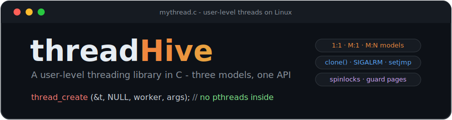
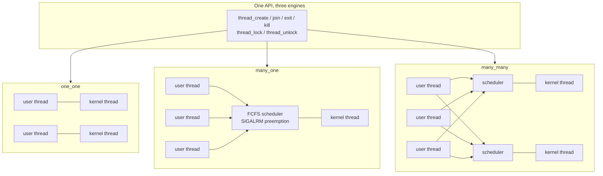
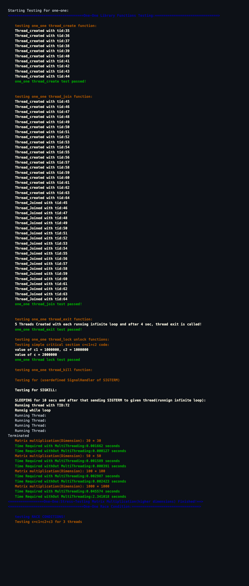

<div align="center">



[](https://gcc.gnu.org/)
[](https://man7.org/linux/man-pages/man2/clone.2.html)
[]()
[](LICENSE)

**A pthreads-style threading library built from scratch on raw `clone()`, signals, and `setjmp` — no pthreads anywhere in the implementation.**

</div>

---

## What is this?

threadHive implements user-level multithreading in C three different ways — the three classic mappings of user threads onto kernel threads that OS textbooks describe, each as a drop-in library with the same API:

| Model | Mapping | How it schedules |
|-------|---------|------------------|
| [`one_one/`](one_one) | 1 user thread : 1 kernel thread | Kernel schedules; each thread is a `clone()`d task on its own `mmap`'d, guard-paged stack |
| [`many_one/`](many_one) | N user threads : 1 kernel thread | Library schedules; `SIGALRM` timer interrupts drive preemptive FCFS context switches via `sigsetjmp`/`siglongjmp` |
| [`many_many/`](many_many) | M user threads : N kernel threads | Each `clone()`d kernel thread runs its own scheduler, multiplexing a shared pool of user threads |

The payoff, from the stress test — multiplying two 1000×1000 matrices with the one-one library:

```text
Matrix multiplication(Dimension): 1000 * 1000
Time Required with MultiThreading:    0.070 seconds
Time Required withOut MultiThreading: 2.484 seconds     ~35x speedup
```

## Architecture



## API

Every model ships the same interface (`mythread.h`):

| Function | Description |
|----------|-------------|
| `int thread_create(mythread_t *t, void *attr, void *func_ptr, void *args)` | Spawn a thread running `func_ptr(args)` |
| `int thread_join(mythread_t *t, void **retval)` | Wait for a thread and collect its return value |
| `void thread_exit(void *retval)` | Terminate the calling thread |
| `int thread_kill(mythread_t *t, int sig)` | Deliver a signal to a specific thread |
| `void thread_lock(spinlock *sl)` / `void thread_unlock(spinlock *sl)` | Spinlock acquire/release (atomic `xchg`-based) |
| `void mythread_setkthreads(int n)` | *(many_many only)* choose the kernel-thread pool size |

```c
#include "mythread.h"

void worker(void *arg) { /* ... */ }

int main(void) {
    mythread_t t;
    thread_create(&t, NULL, worker, NULL);
    thread_join(&t, NULL);
}
```

Link your program against the model you want:

```bash
cc yourprogram.c one_one/mythread.c one_one/lock.c   # or many_one/, many_many/
```

## Running the tests

Linux (x86-64) with gcc:

```bash
bash runall.sh
```

Not on Linux? One Docker command runs the whole suite:

```bash
docker run --rm -t -v "$PWD":/src -w /src gcc:12 bash runall.sh
```

The suite exercises create/join/exit/kill, spinlock critical sections, race-condition checks, and matrix-multiplication stress tests across the models. The one-one section of a real run:

<div align="center">

</div>

## Internals worth reading

- **[`one_one/mythread.c`](one_one/mythread.c)** — threads are `clone()`d with `CLONE_VM | CLONE_FS | CLONE_FILES | CLONE_SIGHAND | CLONE_THREAD`, each on a fresh `mmap`'d stack with a **guard page** in front to catch overflows
- **[`many_one/mythread.c`](many_one/mythread.c)** — a `SIGALRM` interval timer preempts the running user thread; the scheduler saves context in a jump buffer and `siglongjmp`s into the next runnable thread (FCFS)
- **[`many_many/mythread.c`](many_many/mythread.c)** — N kernel threads are `clone()`d, each running its own scheduler over shared linked lists of user threads and kernel threads
- **[`lock.c`](one_one/lock.c)** — spinlocks via inline-assembly atomic exchange, with owner tracking

> Known gaps: the many_many matrix/sync stress tests still segfault under load — the M:N scheduler is the hardest of the three and remains a work in progress (its core API tests pass). The kill/sync tests are also timing-sensitive and can be flaky, especially under QEMU emulation.

## Project structure

```
threadHive/
├── one_one/            # 1:1 model — library + testing/
├── many_one/           # M:1 model — library + testing/
├── many_many/          # M:N model — library + testing/
│   └── (each has mythread.c/.h, lock.c/.h)
├── runall.sh           # Compile + run the test suites
└── docs/               # Logo, test output, coroutines reference
```

## Contributors

- [Abhishek Dharmadhikari](https://github.com/abhi25072002)
- [Sanket Khaire](https://github.com/Sanketkhaire)

## License

[MIT](LICENSE)
